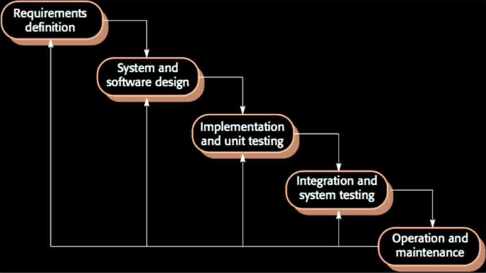
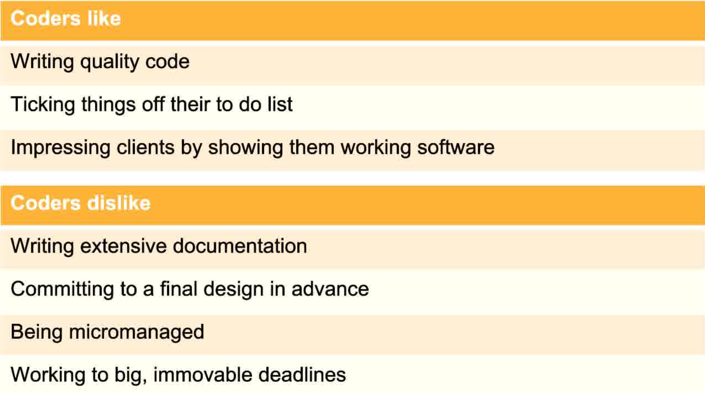
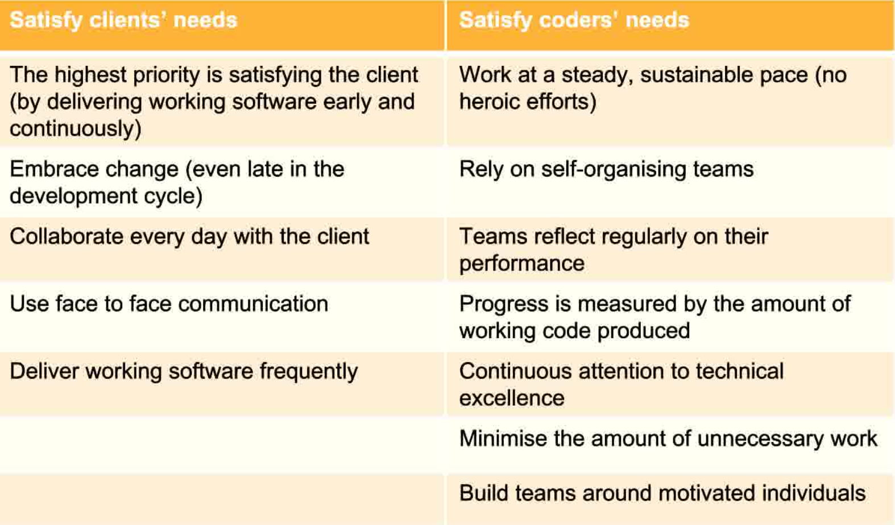

# Software Development

## Introduction

#### Software Crisis

Software is geting larger and more complex, with less time to delivery. This unit isn't about programming, it's about working in teams to deliver large projects using processes that work. 

#### Failures

1. Ariane 5 Flight 501 (rocket exploded, no testing)
2. Mars Climate Orbiter (imperial vs metric system not specified)
3. Therac-25 Radiotherapy (software patch killed people)

#### Why do software projects fail?

* Poor, unnecessary, or overly-ambitious requirements
* Contract management
* End-user testing
* Operational management

## Collaboration Tools and Techniques

* UML Diagrams
* GitHub
* Kanban: Task allocation and progress monitoring
* Test-driven development

#### Software Development Life Cycle

* Requirement Analysis
* Planning
* Design: high level and detailed
* Development
* Testing
* Deployment
* Operation and Maintenance

## Waterfall Model

The first model we started with. 

Stepwise progress, only move on to the next stage after each one is completed

### Requirements

* What should the system do?
* What are the needs of the users?
* What are the needs of the host organisation?
* Does it need to work with existing systems?
* Non-functional properties: security, ease of use, etc.

### Design

* How to structure the system?
* Divide the work. 

### Verification and Validation

* Verification: does the system meet the specifications?
* Validation: does the system do what users want it to do?
* You can meet one but not the othter

### Advantages

* Simple to use
* Defined results and process review
* Development is stage by stage, good for projects with clearly defineed requirements
* Good for projects when all the requirements are known upfront (i.e. government projects)

### Disadvantages

* Software only ready at the end
* High risks and unvertainty
* Bad for projects where requirements change frequently (i.e. start-ups)
* Integration is only done at the end

## Agile Model

Similar to Waterfall, but more in sprints. You do all the stages in short bursts but for many iterations. 

17 software developers met at a ski resort in Utah in winter 2001 to develop the Agile manifesto. 

* Individual and interactions over processes and tools
* Working software over comprehensive documentation
* Customer collaboration over contract negotiation
* Responsing to change over following a plan

### Extreme programming

* Use the simplest way to achieve features
* Sustainable pace
* Coding standards
* Collective ownership
* While team approach

#### Pair Programming

* Helm: does the coding
* Tactician: thinks about implications and potential problems
* Research says that this works!

### Test-driven development

* Tests are written before any code
* This drives all development
* The tests are the requirements and sepcification
* Better code coverage, simplified debugging, self-documentation

### Scrum

* Project management approach
* The scrum: daily stand-up meeting of the entire team
* Scrum Master: team leader
* SPrint: rapid development iteration
* Product Backlog: to-do list of jobs
* Product Owner: client

### Kanban

* Flexible to-do list
* Usually three columns: To do, In progress, Done

### Problems

* Hard to draw up legally binding contracts, less specification produced
* Not so good for improving legacy systems (brownfield development as opposed to greenfield)
* Only workd well for small local teams who know what's going on at every stage

## V-Model

Test-based development, do all the testing at each stage of the Life Cycle.

## Spiral Model

Risk focused, detailed risk analysis at every stage. 

