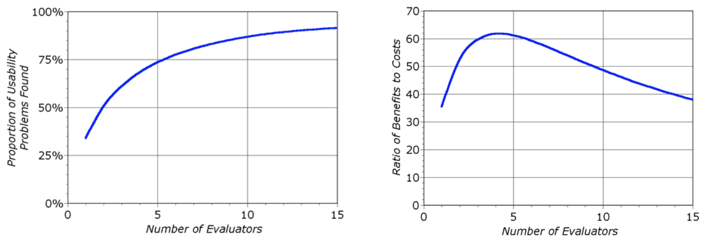
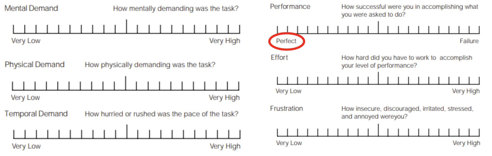
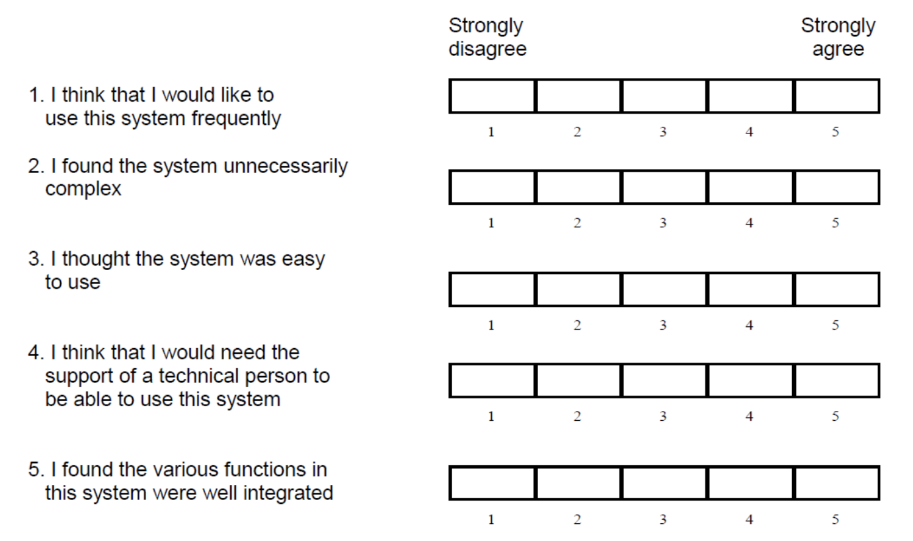
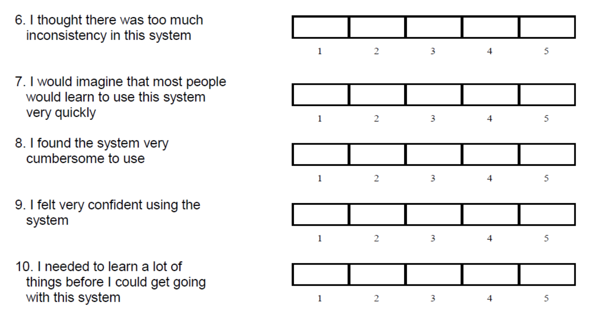
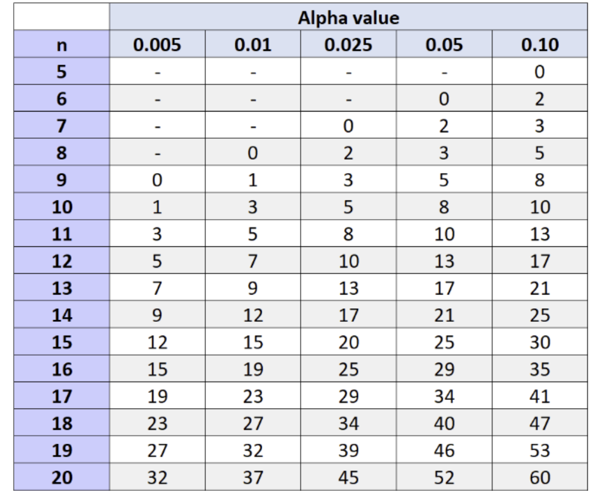

# HCI Evaluation

## Introduction

* Evaluation is important to make sure what you build does what you want it to do 
* Iterative design with user-testing is the only method that consistently produces successful results (Bruce Tognazzini)

## Think Aloud Evaluation (Empirical)

* Users are asked to verbalise what they are thinking and doing as they perform a task using your software
* The Think Aloud technique provides insights into the user experience of using your software
* It can identify issues with the software e.g. navigation problems or content that can be improved
* It can be used as part of the software development process to iteratively improve software or used with a finished product

### Benefits

* Cheap
* Relatively easy
* It provides insight into people’s experiences as they interact with your product
* It can be carried out with low numbers of participants
* Fits in with most software development processes

### Drawbacks

* Subjective, rather than objective
* People may only tell you what they think you want to hear (social desirability bias)

### Steps

* Think of what you want to test for
* Think of several tasks for the user to complete
* Decide on how long and how many people
* One facilitator (explains the task), one or two observers (take notes)
* Participants complete the tasks while saying their thoughts aloud without help

### Analysis

* Categorise the notes from the data
* Count how often each issue is flagged

## Heuristic Evaluation (Analytical)

* A heuristic is a rule of thumb: an evalutation category which is applicable in most cases
* This evaluation is conducted without users (expert evaluation)
* Analytical evaluation instead of imperical evaluation (think-aloud)
* The 10 heuristics (usability principles) are based on research and have been used for over 30 years

### Benefits

* Cheap
* Relatively easy
* Instant results
* Fits in with most software development processes
* Very cost effective: benefit cost ratio of 48

### Drawbacks

* Important issues might be missed
* Might identify false issues
* Can identify many trivial issues
* Experts have biases

### Usability Principles

#### Visibility of system status

Show what is happening as it is happening (i.e. show password strength as you are typing it). 

#### Match between system and real world

Make the interface intuitive to use based on real world similarities.

#### User control and freedom

Allow users to navigate, go back, and go forward easily. Include "breadcrumbs" to clearly show where a user is in the interface (i.e. previous webpages).

#### Consistency and standards

Be consistent with standards in similar software. 

#### Error prevention

Prevent users from making mistakes in the first place. 

#### Recognition rather than recall

Intuitive interfaces are better than making users remember instructions. 

#### Flexibility and efficiency of use

Accelerators (i.e. shortcuts) allow users to speed up interactions as they become more experienced. 

#### Aesthetic and minimalist design

Only include the most important information. 

#### Help users recognise, diagnose and recover from errors

Error messages should be simple, clearly explain the problem and suggest solutions. 

#### Help and documentation

Any documentation should be easy to find and understand. 

### Considerations

* 3-5 evaluators provide the best cost-benefit ratio
* Usually lasts around 1-2 hours

## Questionnaires

* Can be used at scale with few resources
* Can be used to evaluate designs or generate user requirements
* It's quite difficult to create a good quesitonaire: use existing ones!

### NASA Task Load Index (TLX)

* Estimates a user's perceived workload when using a system
* Workload: amount of effort people have to exert, both mentally and physically, to use a system
* gold standard for measuring subjective workload

#### Subscales

An overall workload score is calculated based on a weighted average of ratings on six subscales.

* Mental demand – how much mental and perceptual activity was required?
* Physical demand – how much physical activity was required?
* Temporal demand – how much time pressure did the user feel due to the rate at which tasks occurred?
* Frustration – how insecure, discouraged or irritated did the user feel in the task?
* Effort – how hard did the user have to work (mentally and physically) to accomplish their level of performance?
* Performance – how successfully did the user think they accomplished the task?

#### Method

* Users complete a task
* Users weigh the dimensions in order of importance (see slides)
* Raw TLX scores don't utilise this weighting: studies are inconclusive if this is less accurate
* Users complete each of the six ratings (see slides)
* An aggregate score out of 100 is calculated

### System Usability Scale (SUS)

* Easy and reliable tool for measuring usability
* 10 item questionaire, on a scale from strongly disagree to strongly agree
* Widely used industry standard

#### Method

* Users use the system and complete the form
* An SUS score out of 100 is calculated (see slides)
* A score of 68 is considered average

## Statictical Tests

* Can be used to tell if two result distributions are significantly different

### Wilcoxon Signed Rank Test

* Used to compare two sets of scores from users
* Can be used with a small number of users (minumum 5)

#### Method

* Create a table of scores for each user
* Enter the data into an online calculator
* Choose a significance level: 0.05 means 95% confidence in a significant difference
* Look up the calculated W test statistic in the table of critical values
* W has to be lower than the chosen critical value for there to be a significant difference

### Mann-Whitney U Test

* Used to compare two sets of values generated by two different groups e.g. experienced gamers and novice gamers on the same game