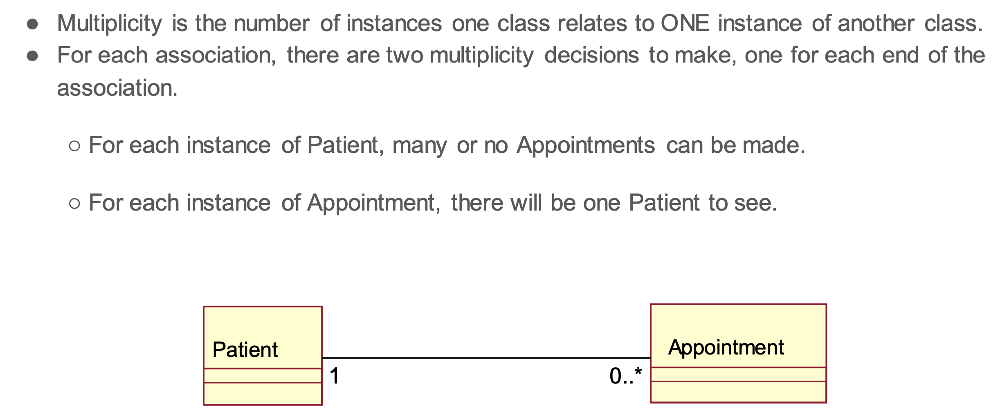

# Object Oriented Design

## Why OOP Design?

* Organise ideas
* Plan work
* Build understanding of the system structure and behavior
* Communicate with development team
* Help (future) maintenance team to understand

## Class Diagrams

Find classes by identifying nouns in text, then narrow down by removing duplicates, variations, irrelevant items and anything out of scope.

### Association

### Multiplicity

### Aggregation

**Shared Aggregation:** a part that can have many wholes  
**Non-shared Aggregation:** a part that can only have one whole  
**Composition:** a whole that cannot exist without a part

### Navigability

### Generalisation

## Modelling behaviour

### Communication diagrams

A communication diagram emphasizes the organisation of the objects that participate in an interaction. The communication diagram shows:

* The objects participating in the interaction.
* Links between the objects.
* Messages passed between the objects.

### Sequence Diagrams

Sequence Diagrams can model simple sequential flow, branching, iteration, recursion and concurrency. They may specify different scenarios/runs:

* Primary
* Variant
* Exceptions

Synchronous messages block the sender from doing anything until there is a reply. 

#### Alt

#### Loop

### Comparison

* Semantically equivalent
* Can convert one diagram to the other without losing any information
* Model the dynamic aspects of a system
* Model a use-case scenario

