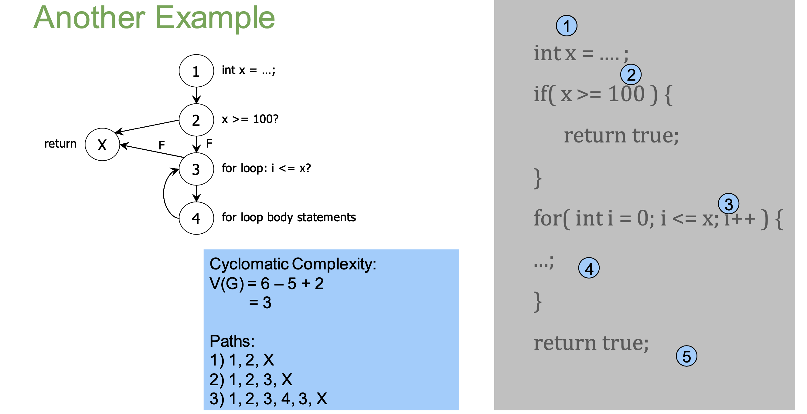
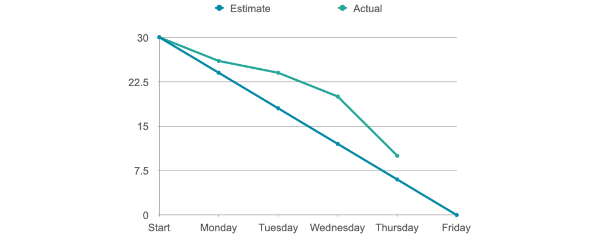

# Project Management

## Measurement
 
* Measurement is important for planning and evaluation
* We attribute values to objects to compare them and make decisions
* But it is difficult to attribute values to objects

### Metrics: Size and Complexity

**Before development:** based on source-code (white-box)  
**After development:** based on requirements/specification (black-box)

### White-box Metrics

#### Number of lines

* Easy to use, widely used
* But not all lines are equal (i.e. efficiency?)
* Comments?
* Every language is different!

#### Cyclomatic Complexity

* Number of independent paths through the code
* Independent path – any path that introduces at least one new statement/condition

Using the control flow graph:

**V(G) = E – N + 2P**

E – number of edges;  
N – number of nodes;  
P – number of procedures (usually 1)  

### Black-box Metrics

#### Story Points

* An arbitrary estimation of how difficult or long each task is
* Each person gives an estimate for a task with their reasons at sprint meetings
* Good to use numbers following the Fibonacci sequence: 1,3,5,8,13,20...
* One option: Planning Poker (see slides for details)

#### Team Velocity

* Number of (estimated) story points implemented per sprint
* Can be derived from previous sprints (i.e. average points implemented from previous sprints)
* Can be used to estimate time needed or tasks to be done

#### Visualised as Burn Charts

## Software Laws

### Patent Law

* A government license preventing others from making, using, or selling an invention
* Lasts for 20 years
* Inventions must be new, innovative and capable of industrial application

### Copyright

* Creators have exclusive rights to perform, copy, adapt their software (code)
* Everyone else must get permission
* Automatically owned (not granted)
* Lasts 70 years after the authors death (lots of exceptions)

### Contract Law

Employer contracts usually force an employee to:

* Not work for anyone else
* Hand over any ideas (Intellectual Property)
* Not disclose company secrets, even after you stop working for them (Non-disclosure-agreements)

### Data Protection

**UK:** Data Protection Act  
**EU:** Data Protection Directive  
**US:** a "patchwork" of state and national laws  

#### 8 Principles of Data Protection

Any company storing "personal data" must make sure it is:

* fairly and lawfully processed (consent, contractual and legal obligations, public interest, ...)
* processed for limited purposes
* adequate, relevant and not excessive
* accurate and, where necessary, kept up to date
* not kept longer than necessary
* processed in accordance with the data subject's rights
* secure - not transferred to countries without adequate protection
