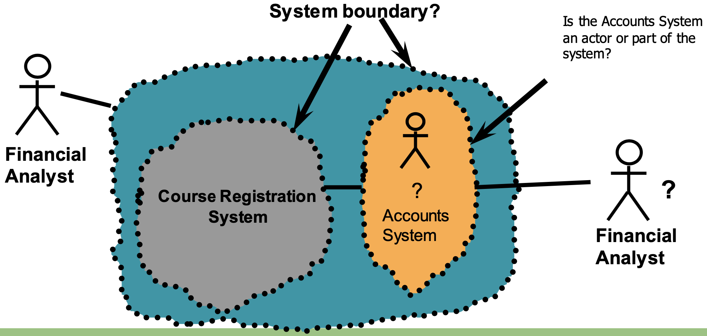

# Requirements Engineering

## Introduction

System requirements specify a system in terms of user observation. 

**Functional requirements:** what the system should do  
**Non-functional requirements:** how should the system do it (i.e. how user-friendly is it)

#### Problems

* Inconsistent terminology
* Conflicting needs
* People don't know what they want
* Requirements change frequently
* Relevant people/information may not be accessible

**Requirements must be precise, complete and clear.**

## Identify stakeholders

Methods of Identification:

* Clients
* Documentation
* Templates (i.e. onion model)
* Similar projects
* Analysing the context of the project
* Keep in mind non-present and negative stakeholders

#### The onion model

## Identify top-level user needs

Identify "user stories"  
As a <user>, I want to <goal> for <reason>.

#### System Behaviour 

How a system acts and reacts.

## Refine Requirements 

### Use-Case Model 

* Links stakeholders to software requirements
* Is a planning tool
* Formed of a diagram and specification
* Shows a set of use cases and actors and their relationships
* Defines clear boundaries of a system
* Identifies who or what interacts with the system
* Summarizes the behavior of the system

**Benefits:** communication, identification, testing

**Actors: EXTERNAL** users or systems that exchange information with the main system

**Use case:** a sequence of actions a system performs that yields an observable result of value to a particular actor

*Decide on where you want the system boundary to be because actors are outside of the boundary*

Finally, don't forget about non-functional requirements! These can just be specified in normal language.

### Example of Use-Case Diagram

The arrows specify the direction of the use-cases. A line means no direction. 

### Example of Inheritance

This arrow demostrates inheritance. Here a bank customer cannot use the "check balance by computer" function because it has additional functions and attributes compared to its parent. 

### Extend / Include

*participates* is like *includes*, but for actors. 

### Use-Case Specification

A description of the flow of events describing the interaction between actors and the system.

* Preconditions
* Postconditions
* Special requirements
* Key scenarios
* Subflows

### Good Use-Cases

* Each use case is independent of the others
* No use cases have very similar behaviors or flows of events
* No part of the flow of events has already been modeled as another use case
* We should ensure that requirements are **verifiable**

#### Checklist

* Consistency: Are there conflicts between requirements?
* Completeness: Have all features been included?
* Comprehendability: Can the requirement be understood?
* Traceability: Is the origin of requirement clearly recorded?
* Realism: Can the requirements be implemented given available resources and technology?
* Verifiability: Can requirements be “ticked off”?

## Specify atomic requirements

Not needed for most projects. 

## Example

