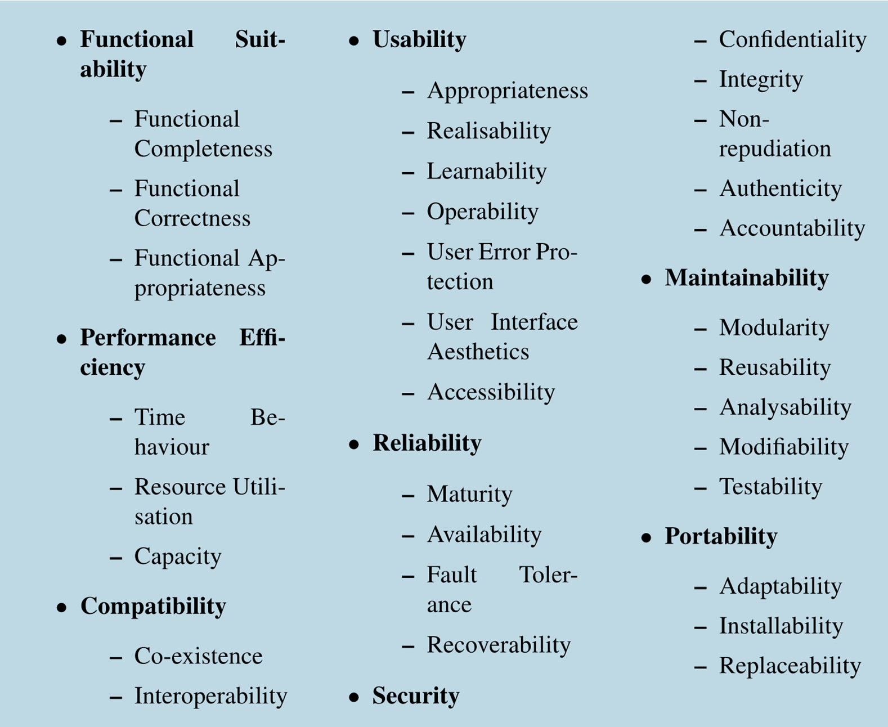
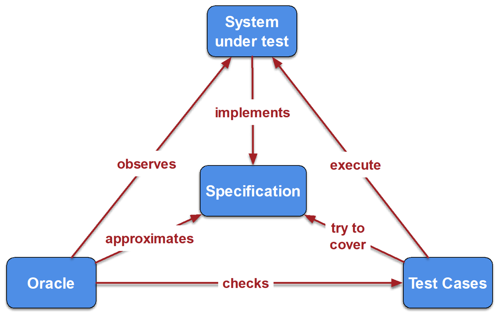

# Software Quality

## Introduction

Software quality is important! Google's Bard mistake cost them 100 billion USD in market capitalisation!

### Why is it Relevant?

* Reputation
* Cost of development and maintenance
* Software certification
* Organisational certification (how much is your comapny trusted to develop software?)
* Legality
* Moral/ethical codes of practice

### Analysis Types

* Subjective, as perceived by users
* Objective, relative to a set of requirements
* Practival (i.e. what does it mean to you and your clients?)

### ISO/IES25010

### Steps Towards Software Quality

* Use a standard development process (already covered)
* Use a coding standard (compliance with industry standards, consistent code quality)
* Define and monitor metrics
* Identify and remove defects

## Testing

Software output can be deterministic (i.e. maths equation) or undeterministic (i.e. Google search). 

The Oracle anticipates the correct outputs from the system. 

### White Box Testing

* Access to software "internals"
* Uses code to measure coverage
* Aims to maximise coverage with tests

There are many coverage metrics, but we will only ook at statement and branch coverage. These are good enough for non-critical aplications, but other metrics like MC/DC exist too. 

#### Statement coverage

* Test inputs should execute every statement
* Detects faults with statements

`Coverage = Statements Executed / Total Stataments`

#### Branch coverage

* Test inputs should execute every branch
* Full branch coverage will also cover all statements

`Coverage = Branches Executed / Total Branches`

#### Considerations

* Don't do white box testing manually!
* Coverage is not strongly correlated with Test Suite Effectiveness

### Black Box Testing

* No access to software "internals"
* We know the interface, usually from a specification
* Many possible combinations of input and output!

#### Equivalence Partitioning (EP) Method

1. Decompose program into “functional units”
2. Identify inputs / parameters for these units
3. For each input  
    a. Identify its limits and characteristics  
    b. Define “partitions” - value categories  
    c. Identify constraints between categories  
    d. Write test specification  

#### Considerations

* Most errors happen in the edge cases
* Remember to test at, under and above the boudary values